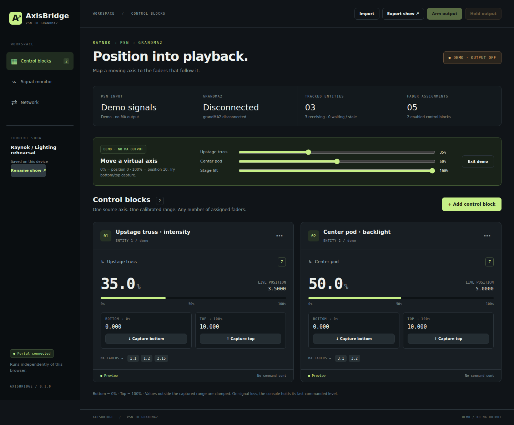

# AxisBridge

PSN position data from Raynok → calibrated grandMA2 fader levels, with a web portal for setup and monitoring. Runs on macOS, Windows, and Raspberry Pi OS using Python 3.10 or newer. The bridge runs locally; no cloud or internet connection is needed during use.

This release is runnable source with launchers, tests, and an optional native executable build script. Signed Mac/Windows installers are not included. Protocol and simulated-console tests have been run on Linux; Raynok, physical grandMA2, macOS, Windows, and Pi hardware still require acceptance testing.


## Downloads and setup

- [Mac, Windows, and Raspberry Pi source package](downloads/AxisBridge-v0.1.0.zip)
- [Slate 7 installer](downloads/AxisBridge-Slate7-Installer-v0.1.0.tar.gz)
- [Slate 7 quick start](downloads/AxisBridge-Slate7-Quick-Start.md)
- [Slate 7 full setup guide](slate7/SETUP.md)



## Repository layout

- `axisbridge/`: bridge engine, PSN decoder, grandMA2 transport, and web portal.
- `run.py`: desktop/Pi entrypoint.
- `tests/`: app protocol, network, and portal tests.
- `slate7/`: complete router installer source and its tests.
- `downloads/`: packaged snapshots matching the supplied versions.

The Slate 7 installer includes a copy of the app in `slate7/payload/app/`. When
updating the app, refresh that payload and its `SHA256SUMS`, then rebuild the
installer archive. Packaged downloads do not update automatically with source edits.

## Start the app

Extract the entire ZIP before running. Install Python 3.10+ if it is not already available.

| Platform | Launch from the extracted AxisBridge directory |
|---|---|
| Windows | Double-click `Start-Windows.bat`, or run `py -3 run.py` |
| Mac | Run `python3 run.py` in Terminal. `Start-Mac.command` is also included; if needed, run `chmod +x Start-Mac.command` once before opening it. |
| Raspberry Pi with a desktop | Run `python3 run.py` |
| Headless Raspberry Pi | Run `python3 run.py --no-browser` and open the printed LAN URL from another computer/tablet |

The app opens the portal at **http://127.0.0.1:8080**. On another device, open **http://BRIDGE-IP:8080**, using an IP of the computer/Pi running AxisBridge. Enter the portal access key printed by the app. The local browser opens already signed in. The portal works on phone/tablet screens too.

The process must remain running. Closing the browser does not stop the bridge; closing the app/terminal does. Ctrl+C stops it. Use `--port 8081` if 8080 is occupied. Use `--host 127.0.0.1` to allow local access only. Default portal binding is all adapters. The access key is saved at `~/AxisBridge/portal-key.txt`; delete that file while the app is stopped to regenerate it. The portal and MA Telnet connection use plain HTTP/TCP; use them on your trusted production LAN, not an internet-facing port.

Full adapter-name discovery is optional. Without the extra package, enter the exact IPv4 address of either local adapter manually. To install full discovery in an isolated environment:

```sh
python3 -m venv .venv
.venv/bin/python -m pip install -r requirements.txt
```

On Windows:

```bat
py -3 -m venv .venv
.venv\Scripts\python -m pip install -r requirements.txt
```

The provided launchers automatically use `.venv` when it exists.

## Set up the two adapters

Configure static addresses in the operating system, with each adapter on its own subnet. AxisBridge binds outbound MA TCP to the specified MA IPv4 address. PSN unicast binds directly to the specified PSN IPv4 address; multicast joins the selected group on that adapter. The app does not bridge, route, or forward packets between networks and does not change the computer's network settings.

Example only — use the addresses that fit your show:

| Connection | Bridge adapter IPv4 | Other equipment |
|---|---|---|
| PSN / Raynok | 10.10.10.20/24 | Raynok sender 10.10.10.10 |
| MA / grandMA2 | 192.168.0.20/24 | Console 192.168.0.1 |

In **Network**, select or enter those local adapter addresses. Leave the source filter blank to discover every sender, or enter Raynok's source IP to accept just that sender. Entity identity is sender IPv4 + PSN tracker ID, so identical IDs on two senders remain separate.

PSN defaults are multicast **236.10.10.10**, UDP **56565**. Match these to Raynok. If Raynok is configured for unicast, select **Unicast** and send to the bridge's PSN adapter address. Allow incoming UDP on the selected PSN port and TCP 8080 for remote portal access in the host firewall. A selected adapter must have its address assigned before the app can bind to it. On Linux, the multicast receiver disables `IP_MULTICAST_ALL` so other sockets' group memberships are not inherited.

On grandMA2, enable:

**Setup → Console → Global Settings → Telnet → Login Enabled**

Enter the console/onPC IP, TCP **30000**, and a grandMA2 username with playback rights. Enter its password when connecting. The MA password is stored separately in `~/AxisBridge/ma-password.txt` with owner-only permissions for automatic reconnect; it is never saved in a show or export.

Click **Save network**, **Start PSN**, then **Connect MA** once. With both auto-connect checkboxes enabled, later app launches start PSN and connect MA automatically. Stop PSN and disconnect MA before changing network settings. MA connection attempts automatically retry every three seconds. A successful TCP connection alone is not enough: the bridge waits for a grandMA2 login acknowledgement before allowing output.

**MA network compatibility:** AxisBridge uses grandMA2's documented Telnet command interface over the MA-side adapter. It does not speak the proprietary MA-Net2 session protocol or appear as an MA station. No grandMA2 plugin is required. It controls fader levels, not console parameter licensing. Normal grandMA2/onPC output hardware and licensing requirements still apply.

## Build a show

1. Add a **Control block** and name it.
2. Select a discovered PSN entity. You can also enter a sender IPv4 and tracker ID before connecting.
3. Select exactly one axis: **X, Y, Z** (position) or **RX, RY, RZ** (orientation). Orientation is available only if the sender provides it.
4. Assign one or more faders as explicit **page.executor** addresses, separated by commas: `1.1, 1.2, 2.15`. This targets those pages even if the operator changes pages on the desk. Two enabled blocks cannot share a destination.
5. Save the block. Move the axis to the desired bottom position and click **Capture bottom**. Move it to the desired top position and click **Capture top**. Capture always reads the latest received sample on the bridge, not a possibly stale browser value. Alternatively, enter exact endpoint values in the editor.
6. Confirm the percentage tracks the movement correctly, then click **Arm output**. Every enabled block must have a fresh input, both endpoints, and at least one fader assignment before arming.

Mapping:

```text
percent = clamp(100 × (position − bottom) / (top − bottom), 0, 100)
```

Captured bottom is 0%; captured top is 100%. Descending ranges work: bottom 10 and top 0 maps position 5 to 50%. Negative positions are supported. Identical endpoints are rejected. Changing the source/entity/axis in the editor clears its old calibration. Use a new range after changing Raynok's units or coordinate setup. Orientation uses a linear range; it does not unwrap a rotating axis across its wrap boundary.

Each assigned output receives a command like:

```text
Fader 1.1 At 50.00
Fader 1.2 At 50.00
Fader 2.15 At 50.00
```

This moves the executor's assigned fader function. Configure Master/Temp/Speed and Auto Start/Stop on grandMA2 to produce your intended behavior. AxisBridge does not press Go, change the fader assignment, or create executors on the console. Fader motion can start/stop an executor if its MA options are configured that way.

## Monitoring and output behavior

- The dashboard shows each axis value and its calibrated percentage. With smoothing enabled, this percentage is the unsmoothed target; **Last sent** shows the emitted fader value.
- Signal Monitor lists source/ID, positions, orientation, freshness, last commands, and connection events. Values are in the source's units.
- **Last sent** is transport output, **not console fader readback or proof the console applied a command**. A supported login is confirmed; physical fader state is not polled. Last-sent values remain visible after Hold until the show is edited.
- Output defaults to **25 Hz**, adjustable from 1 to 40 Hz. Deadband defaults to 0.1 percentage points. Commands are sent when values change enough, at exact endpoints, and every ten seconds while fresh to maintain ownership. Only current positions are sent; there is no motion queue to replay after a disconnect.
- Optional smoothing is an exponential response in milliseconds; 0 disables it. A setting of 100 ms reaches about 63% of a sudden change after 100 ms. The initial/re-armed output starts at the current mapped position.
- Missing/stale axes hold their last commanded console value and stop sending for that block. The default freshness timeout is 1000 ms. Name/info packets do not keep old position samples alive. Output resumes at the current position when that axis becomes fresh again while the bridge remains armed.
- **Hold output** stops sending fader commands without forcing faders to zero. The desk is then available for manual control. Editing or recapturing requires Hold.
- A console disconnect/error disarms all output. The app reconnects, but you must re-arm before faders follow again. PSN receiver failure also disarms output.
- Startup restores the saved show and, when enabled, automatically starts PSN and reconnects MA. Output always remains held, so starting after reboot never automatically moves a fader.
- Save changes in the portal to persist them automatically at `~/AxisBridge/current-show.json`. **Export show** downloads a portable JSON file; **Import** loads one. Passwords, portal keys, arm state, and live samples are excluded. The separate owner-only password file is local to this bridge. Concurrent edits from two browsers are rejected rather than silently overwriting each other.
- This version permits 128 blocks and 64 targets per block. Console throughput must be measured with your actual assignment count before use.

## Try the workflow without hardware

Click **Try with demo signals** in an empty show, or **Demo signals** in Signal Monitor. It stops real PSN input and holds output. Three controllable virtual entities appear; their sliders map 0–100 to source positions 0–10. Create a block with source `demo`, select an entity and axis, move its slider to 0 and capture bottom, then move it to 100 and capture top. The calculated percentage will follow the slider.

To test assigned faders on grandMA2, save the MA network settings, connect MA, and click **Arm demo to MA**. A confirmation appears before arming. Moving a demo slider updates its simulated PSN entity immediately and transmits normal fader commands to its assigned targets. Demo output starts held, requires an authenticated MA connection, and returns to held when demo mode is closed, the connection drops, or **Hold output** is clicked. Exit demo and select real Raynok sources/calibrate again for live tracking.

For a separate process sending actual UDP PSN packets, use:

```sh
python3 scripts/psn_sender.py --interface 127.0.0.1 --destination 127.0.0.1
```

Set the receiver to unicast on 127.0.0.1:56565, Start PSN, and select tracker 7. Add `--value 3.5` to send a fixed Z position. This diagnostic sender is manual and never starts automatically.

## Optional native builds

Build separately **on each target OS and CPU architecture**. PyInstaller does not cross-build Windows/Mac/Linux executables from one host. On a Pi, build on the Pi or matching ARM environment.

```sh
python -m pip install pyinstaller psutil
python scripts/build.py
```

Use `python3` on Mac/Pi if that is your Python command. The result appears in `dist/AxisBridge` or `dist/AxisBridge.exe` with portal assets included and no separate Python install needed. This is a console executable that launches a browser, not a signed/notarized installer. The supplied source has no GUI toolkit or display-server requirement.

## Verification

Run the suite from the extracted directory:

```sh
python3 -m unittest discover -s tests -v
```

The tests cover calibration, reversed limits, malformed/truncated/non-finite PSN packets, metadata freshness, packet ordering, colliding tracker IDs, VYV reference-encoder split frames, show validation/persistence, portal authentication/origin checks, real UDP-to-TCP mapping with a mock MA login, source-address binding, stale-signal hold, and disconnect disarming. The mock server verifies generated commands; it does not validate a physical grandMA2 console's behavior.

Before a show, confirm one unused executor responds correctly at 0%, 50%, and 100%; verify the intended Master/Temp behavior; then test Raynok loss and MA reconnection. No physical equipment was available during development of this release.

## Protocol references

- MA Lighting: [Telnet Remote](https://help.malighting.com/grandMA2/en/help/key_remote_control_telnet.html)
- MA Lighting: [Fader Keyword](https://help.malighting.com/grandMA2/en/help/key_keyword_fader.html)
- VYV: [PSN reference implementation and specification](https://github.com/vyv/psn-cpp)
- Bitfocus: [grandMA2 module](https://github.com/bitfocus/companion-module-malighting-grandma2) — cross-checked login acknowledgement text against its implementation. No Bitfocus code is bundled.
